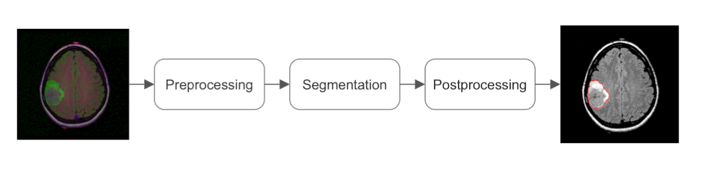

# 545 Project: Brain Segmentation


## Install (in a conda environment preferably)

```
pip install -r requirements.txt
```


## Dataset

Dataset used for development and evaluation was made publicly available on Kaggle: [kaggle.com/mateuszbuda/lgg-mri-segmentation](https://www.kaggle.com/mateuszbuda/lgg-mri-segmentation). It contains MR images from [TCIA LGG collection](https://wiki.cancerimagingarchive.net/display/Public/TCGA-LGG) with segmentation masks approved by a board-certified radiologist at Duke University.

**Please download the dataset and place it as `./kaggle`.**


## Pipeline



- Preprocessing: this step is done by function `data_loaders` in `dataset.py`. Load both training set and validation set as follows

  ```
  loader_train, loader_valid = data_loaders(batch_size=16, workers=2, image_size=224, aug_scale=0.05, aug_angle=15)
  ```

  or, load only validation set as

  ```
  _, loader_valid = data_loaders(batch_size=16, workers=2, image_size=224, aug_scale=0.05, aug_angle=15, valid_only=True)
  ```

  Loading both dataloader will take 10-20 minutes and loading only validation set will take 1-2 minutes.

- Segmentation: We will try different models for segmentation.

- Postprocessing: this step is done by function `postprocess_per_volume` in `dataset.py`

**Check out [this notebook](https://github.com/Jn-Huang/545_project_brain_segmentation/blob/main/notebooks/data_pipeline.ipynb) for a demo on our data processing pipeline. Contact Jin anytime if you have any problems.**


## Training

[Example training code on Unet](https://github.com/Jn-Huang/545_project_brain_segmentation/blob/main/unet_train.py) might be helpful to build your own training script.


## References

https://github.com/mateuszbuda/brain-segmentation-pytorch

